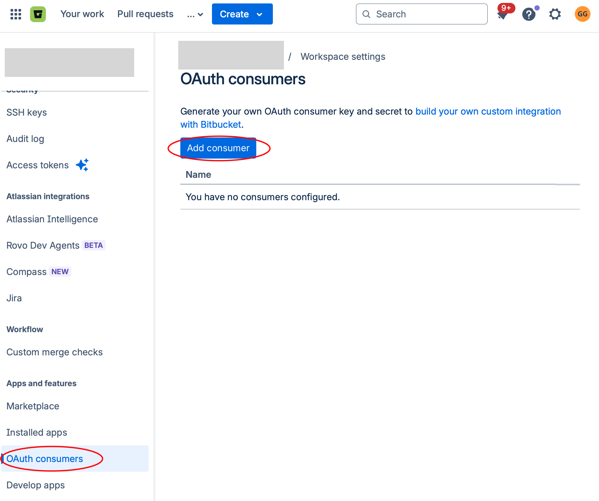
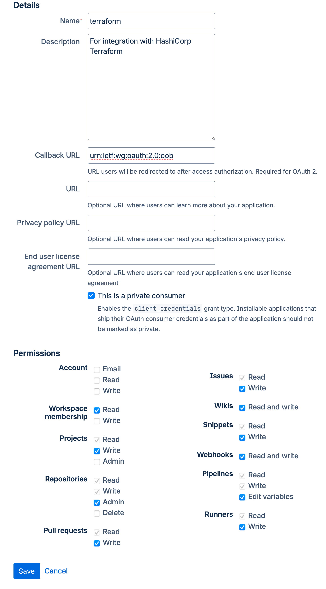
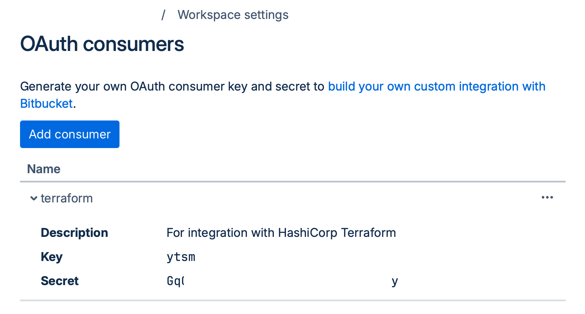

# Terraform Provider for Bitbucket Cloud

[](https://goreportcard.com/report/github.com/gilesgamon/terraform-provider-bitbucket)
[](LICENSE)

Manage [Bitbucket Cloud](https://bitbucket.org) resources — repositories,
projects, pipelines, deploy keys, webhooks, permissions and more — with
Terraform.

- **Resources:** 32
- **Data sources:** 121
- **Terraform SDK:** [terraform-plugin-sdk v2](https://github.com/hashicorp/terraform-plugin-sdk)

> The provider tracks the Bitbucket Cloud REST API. The vendored OpenAPI
> specification used as the source of truth lives in
> [`reference/swagger.v3.json`](reference/swagger.v3.json).

## Requirements

- [Terraform](https://developer.hashicorp.com/terraform/downloads) >= 1.0
- [Go](https://go.dev/doc/install) >= 1.23 (only to build from source)

## Installation

```hcl
terraform {
  required_providers {
    bitbucket = {
      source  = "gilesgamon/terraform-provider-bitbucket"
      version = "~> 0.1"
    }
  }
}
```

## Authentication

The provider supports three authentication methods. Configure exactly one.

```hcl
# 1. Username + App Password
provider "bitbucket" {
  username = "my-user"
  password = "my-app-password" # https://bitbucket.org/account/settings/app-passwords/
}

# 2. OAuth 2.0 Client Credentials
provider "bitbucket" {
  oauth_client_id     = "..."
  oauth_client_secret = "..."
}

# 3. OAuth 2.0 Access Token
provider "bitbucket" {
  oauth_token = "..."
}
```

Every option can also be supplied via environment variables:
`BITBUCKET_USERNAME`, `BITBUCKET_PASSWORD`, `BITBUCKET_OAUTH_CLIENT_ID`,
`BITBUCKET_OAUTH_CLIENT_SECRET`, and `BITBUCKET_OAUTH_TOKEN`.

Each resource and data source documents the OAuth2 scopes it requires.

### Creating an OAuth consumer

For the OAuth Client Credentials flow, create a *Consumer* by navigating to
**Workspace settings → OAuth consumers → Add consumer**.



For **Callback URL** use `urn:ietf:wg:oauth:2.0:oob`. The remaining settings are
at your discretion, but you must grant sufficient **scopes** for the work
required. For example, attempting to plan without `repository:admin` (which was
required for the task below) produces:

```text
│ Error: 403 Forbidden: {"type": "error", "error": {"message": "Your credentials lack one or more required privilege scopes.", "detail": {"required": ["repository:admin"], "granted": ["runner:write", "pipeline:variable", "webhook", "snippet:write", "wiki", "issue:write", "pullrequest:write", "project", "team"]}}}
```

Scopes cannot be edited after creation — you must re-create the consumer if the
granted scopes do not meet your needs.



Once saved, you can access the credentials. The **Key** is the
`oauth_client_id` and the **Secret** is the `oauth_client_secret`.



## Example

```hcl
resource "bitbucket_project" "infra" {
  owner = "my-workspace"
  name  = "Infrastructure"
  key   = "INFRA"
}

resource "bitbucket_repository" "app" {
  owner       = "my-workspace"
  name        = "app"
  project_key = bitbucket_project.infra.key
  is_private  = true
}

data "bitbucket_tags" "app" {
  workspace = "my-workspace"
  repo_slug = bitbucket_repository.app.name
}
```

More runnable configurations live under [`examples/`](examples/).

## Documentation

Reference documentation for every resource and data source is under
[`docs/`](docs/) and is published on the
[Terraform Registry](https://registry.terraform.io/providers/gilesgamon/terraform-provider-bitbucket/latest/docs).

## Contributing

Contributions are welcome. See [CONTRIBUTING.md](CONTRIBUTING.md) for how to
build, test, and submit changes, and [ROADMAP.md](ROADMAP.md) for planned work.

## License

Mozilla Public License 2.0 — see [LICENSE](LICENSE).
